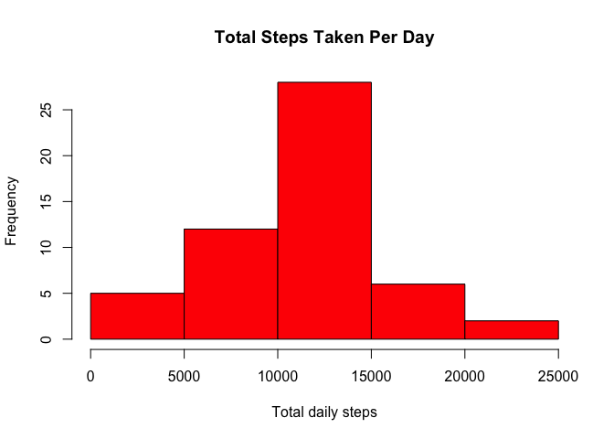
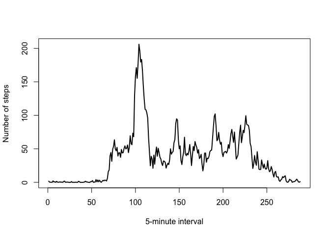
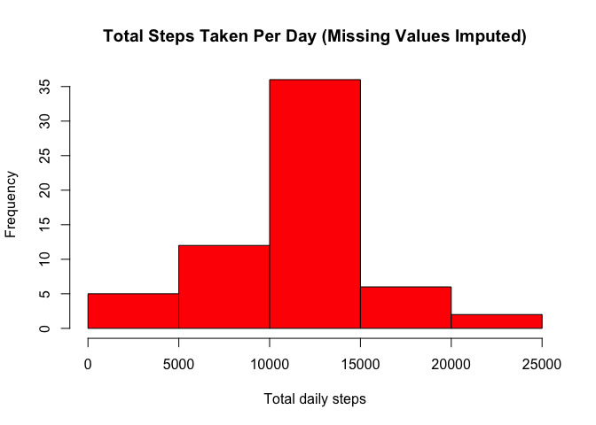
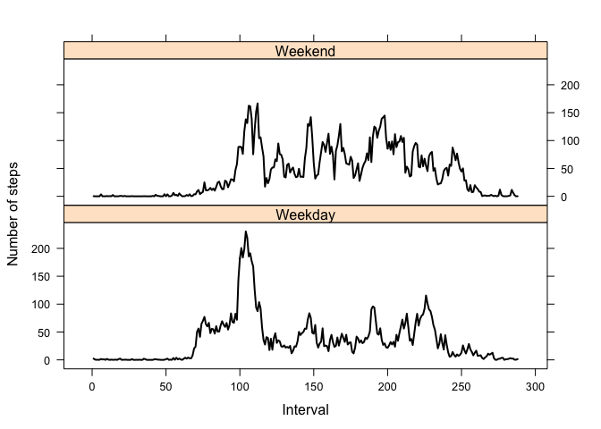

# Reproducible Research: Peer Assessment 1

```r
today <- format(Sys.Date(), format="%A %B %d, %Y")
```

Report generated on Friday August 07, 2015.

This report summarises data on the number of steps recorded by a personal activity monitoring device. These data were recorded in 5-minute intervals over a period of 61 days. These data were downloaded from http://d396qusza40orc.cloudfront.net/repdata/data/activity.zip on August 07, 2015.

## Loading and preprocessing the data

1. This first chunk will read in the raw data set.

```r
rm(list = ls())
download.file("http://d396qusza40orc.cloudfront.net/repdata/data/activity.zip", "activity.zip")
unzip("activity.zip")
data <- read.csv("activity.csv")
```

2. As each question requires specific data manipulations, no further processing will be undertaken in this section. Instead, the processing will be carried out in the section answering the question.

## What is mean total number of steps taken per day?

1. The original data set is collapsed to take the sum of steps per day, excluding missing variables.

```r
require(plyr)
data$missing <- as.integer(is.na(data$steps))
cdata1 <- ddply(data, "date", summarise,
               sum_steps = sum(steps, na.rm = TRUE),
               sum_miss = sum(missing)
               )
cdata1 <- subset(cdata1, subset = (sum_miss == 0))
cdata1 <- cdata1[c("date", "sum_steps")]
```

2. The histogram of the total mean number of steps is demonstrated below:

```r
hist(cdata1$sum_steps, 
     main = "Total Steps Taken Per Day",
     xlab = "Total daily steps",
     col = "red")
```

 


```r
mean = as.character(round(mean(cdata1$sum_steps, na.rm = TRUE)))
median = median(cdata1$sum_steps, na.rm = TRUE)
```

3. The **mean** total number of steps per days is **10766** and the **median** is **10765**.  

## What is the average daily activity pattern?

The original data set is collapsed to take the mean number of steps per 5-minute time interval, excluding missing variables.

```r
data$interval <- as.factor(data$interval)
cdata2 <- ddply(data, "interval", summarise,
                mean_steps = mean(steps, na.rm = TRUE)
                )
```

1. The time series of the mean number of steps across the course of the day is demonstrated below:

```r
plot(cdata2$mean_steps, 
     type = "l",
     ylab = "Number of steps",
     xlab = "5-minute interval",
     lwd = 2)
```

 


```r
max <- rownames(subset(cdata2, subset = (mean_steps == max(cdata2$mean_steps))))
```

2. The 5-minute interval containing, on average, the **maximum** number of steps is number **104**.

## Imputing missing values


```r
missing <- length(which(is.na(data)))
total <- nrow(data)
```

1. The number of missing values is **2304** of a total of **17568** observations.

2. The imputation strategy was to replace missing values of the numbers of steps with the mean per 5-minute interval. To then calculate the total number of steps, this was collapsed to the total number of steps per day.

```r
require(dplyr)
int_mean <- data.frame(ddply(data, "interval", summarise,
                              mean_steps = mean(steps, na.rm = TRUE)
                             )
                       ) 
data_imp <- left_join(data, int_mean, 
                      by = "interval")
data_imp$steps[is.na(data_imp$steps)] = data_imp$mean_steps
data_imp <- data_imp[c("steps", "date", "interval")]
rm(int_mean)

cdata3 <- ddply(data_imp, "date", summarise, 
                sum_steps = sum(steps)
                )
```

3. The histogram of the total mean number of steps after replacing the missing values is demonstrated below:

```r
hist(cdata3$sum_steps, 
     main = "Total Steps Taken Per Day (Missing Values Imputed)",
     xlab = "Total daily steps",
     col = "red")
```

 


```r
mean = as.character(round(mean(cdata3$sum_steps, na.rm = TRUE)))
median =  as.character(round(median(cdata3$sum_steps, na.rm = TRUE)))
```

4. The **mean** total number of steps per days per day after replacing the missing values is **10766** and the **median** is **10766**. This is very close to the data set that did not impute the missing values. The way in which they differ is that the median is now equal to the mean, and the middle bin of the histogram represents a greater proportion of the data, reflecting the fact that the mean value was used to fill in the missing data. 

## Are there differences in activity patterns between weekdays and weekends?

1. A "weekend" variable was generated in the data set where the missing values of steps have been imputed.

```r
data_imp$date <- as.Date(data_imp$date, 
                         "%Y-%m-%d")
data_imp$day <- weekdays(data_imp$date, 
                         abbreviate = FALSE)
data_imp$weekend <- ifelse((data_imp$day == "Saturday" | data_imp$day == "Sunday"), "Weekend", 
                           "Weekday")
data_imp$interval <- as.factor(data_imp$interval)
data_imp$weekend <- as.factor(data_imp$weekend)

cdata4 <- ddply(data_imp, c("interval", "weekend"), summarise, 
                mean_steps = mean(steps, na.rm = TRUE)
                )
cdata4$interval <- as.integer(cdata4$interval)
```

2. A panel time series plot comparing the pattern of steps over the day for weekdays (Monday to Friday) compared to weekend (Saturday and Sunday) is shown below:

```r
require(lattice)
xyplot(mean_steps ~ interval | weekend, 
       data = cdata4, 
       layout = c(1, 2),
       type = "l",
       col.line = "black",
       lwd = 2,
       xlab = list(label = "Interval"),
       ylab = list(label = "Number of steps")
       )
```

 

The pattern appears to differ between weekends and weekdays, with the majority of daily steps occurring at the beginning of the day on weekdays, but more evenly distributed throughout the day on weekends.
